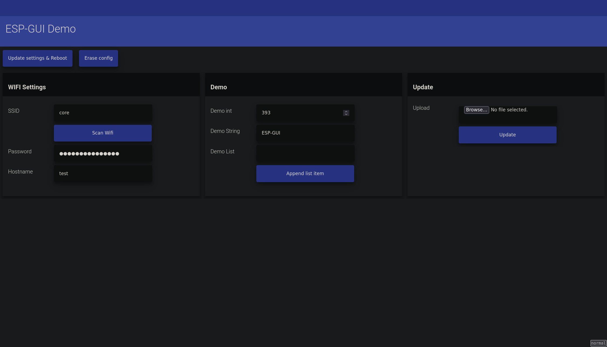

# ESP-GUI

This library provides an easy way to create a simple GUI for ESP8266

## Features
* WiFi Configuration with config hot spot
* UpdateManager to allow firmware updates via web UI
* Several control elements
  * Buttons
  * Input
    * Text
    * Password
    * Number (Double, Int)
* Configuration and storage to eeprom
* Responsive UI working on mobile and desktop
* 100% C++

### Non-Features
* Styling
* Custom controls

## Dependencies
* ESP Async WebServer@>=1.2.0
* ESP AsyncTCP@>=1.2.2
* AsyncTCP@>=1.1.1
* ArduinoJson@>=6.19.4
* yal

## Examples

See `examples/src/`

## Screenshots

The screenshots are made from the example

### Desktop

### Mobile

